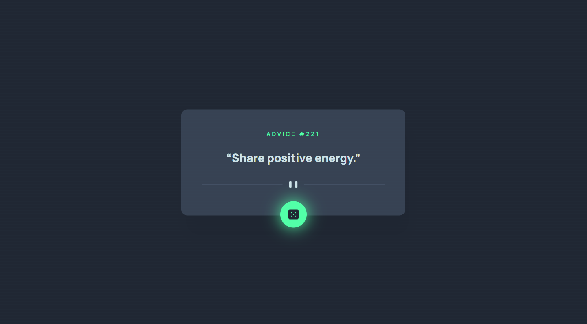
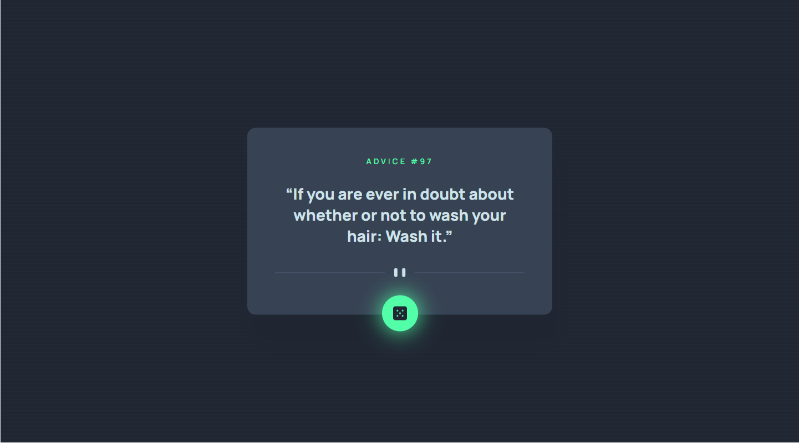
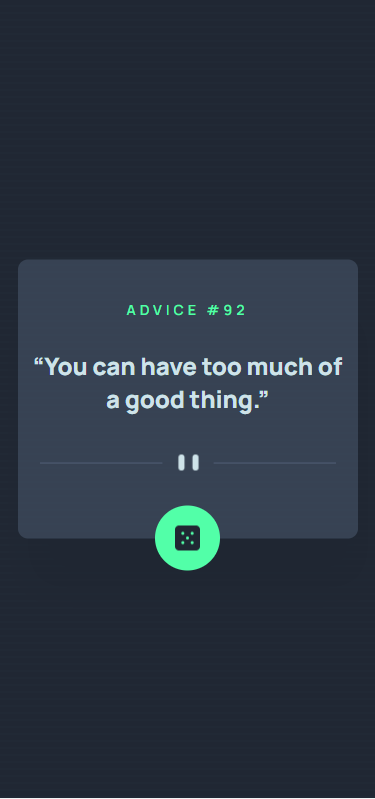

# Sign-up form component

Project from [Frontend Mentor](https://www.frontendmentor.io/challenges/advice-generator-app-QdUG-13db).
It was made in technologies: HTML,CSS,JS,jQuery,AJAX.

This challenge is to build out interactive advise generator app and get it looking as close to the design as possible.

The application has an optimal layout depending on the screen size of the device.
Application communicate with external REST API.

